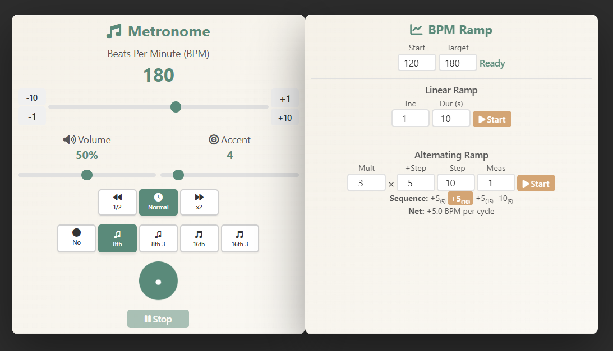

# Advanced Metronome Application

A professional-grade metronome application built with **React**, **TypeScript**, and **Vite**. Features precise timing, BPM ramping, and a modern, compact UI.




## Features

### Core Metronome
- **Precise BPM Control**: Adjustable from 40-280 BPM with multiple input methods
- **Volume Control**: Adjustable volume with visual feedback
- **Accent Patterns**: Configurable beats per measure (1-32)
- **Subdivision Modes**: No, 8th notes, triplets, 16th notes, and 16th triplets
- **Feel Modes**: Normal, double time (×2), and half time (1/2)
- **Tap Tempo**: Click the visual indicator to set BPM by tapping rhythmically
- **Visual Feedback**: Animated indicator shows beat timing

### BPM Ramping
- **Linear Ramp**: Gradually increase/decrease BPM from start to target over a specified duration
- **Alternating Ramp**: Advanced pattern with positive and negative steps
  - Configurable multiplier × positive step, followed by negative step
  - Real-time sequence visualization with active step highlighting
  - Shows cumulative BPM change from start for each step
  - Net BPM gain per cycle calculation

## Technology Stack

- **React 18** with TypeScript
- **Vite** for fast development and building
- **Web Audio API** for precise audio generation / no external samples used
- **Vitest** for testing
- **Modern React Patterns**: `useSyncExternalStore` for external state management

## Project Structure

```
src/
├── components/          # React components
│   ├── BPMControl.tsx           # BPM adjustment with slider and buttons
│   ├── MetronomePanel.tsx       # Main metronome controls
│   ├── RampPanel.tsx            # BPM ramping controls
│   ├── AlternatingRampControl.tsx # Alternating ramp configuration
│   ├── RampControl.tsx          # Linear ramp configuration
│   ├── VisualIndicator.tsx      # Beat visualization and tap tempo
│   └── ...                      # Other UI components
├── hooks/
│   └── useMetronome.ts          # React hook for metronome state
├── utils/
│   ├── timing.ts               # BPM/ms conversion and timing calculations
│   ├── validation.ts            # Value clamping utilities
│   └── *.test.ts                # Unit tests
├── audio.ts                     # Web Audio API wrapper
├── metronome.ts                 # Core metronome engine
├── styles.ts                    # Reusable spacing theme and styles
├── constants.ts                 # Application constants
└── types.ts                     # TypeScript type definitions
```

## Architecture

### Design Patterns

- **Event-Driven Architecture**: Metronome uses native `EventTarget` API for decoupled communication
- **React Hooks**: Custom `useMetronome` hook with `useSyncExternalStore` for external state
- **Component Composition**: Reusable, focused components
- **Theme System**: Centralized spacing, colors, and styling

### Key Features

- **Precise Timing**: Recursive `setTimeout` for smooth BPM changes
- **Type Safety**: Full TypeScript with strict mode
- **Reusable Theme**: Centralized spacing system (padding, margin, gap)
- **Test Coverage**: Unit tests for utilities and core logic
- **Clean Architecture**: Separation of concerns (UI, business logic, audio)

## Development

```bash
# Install dependencies
npm install

# Start development server
npm run dev

# Build for production
npm run build

# Preview production build
npm run preview

# Run tests
npm test

# Run tests with UI
npm run test:ui

# Run tests with coverage
npm run test:coverage
```

## Usage

### Basic Controls

- **BPM**: Adjust using slider, +/- buttons, or mouse wheel on BPM display
- **Volume**: Use volume slider (0-100%)
- **Accent Pattern**: Set beats per measure (1-32)
- **Subdivisions**: Select subdivision mode from radio buttons
- **Feel**: Choose normal, double, or half time
- **Start/Stop**: Click the play/pause button

### BPM Ramping

#### Linear Ramp
1. Set Start and Target BPM values
2. Configure increment (BPM change per step) and duration (seconds)
3. Click Start to begin ramping

#### Alternating Ramp
1. Set Start and Target BPM values
2. Configure:
   - **Mult × +Step**: Number of positive steps and their value
   - **-Step**: Negative step value
   - **Meas**: Measures per step
3. The sequence shows the pattern with cumulative BPM changes
4. Active step is highlighted during ramping
5. Click Start to begin

### Tap Tempo

Click the visual indicator repeatedly at your desired tempo. The metronome will calculate and set the BPM based on your taps.

## Testing

The project includes comprehensive unit tests using Vitest:

- **Timing utilities**: BPM conversion, beat interval calculation, average interval
- **Validation utilities**: Value clamping with various ranges
- **Test coverage**: Core functionality is tested

Run tests with:
```bash
npm test
```

## Code Quality

- **TypeScript**: Strict type checking throughout
- **React Best Practices**: Hooks, composition, and modern patterns
- **Reusable Components**: DRY principles with shared components
- **Theme System**: Centralized spacing and styling
- **Documentation**: JSDoc comments for key functions
- **Error Handling**: Comprehensive error handling with event emission

## Browser Support

Modern browsers with Web Audio API support:
- Chrome/Edge (latest)
- Firefox (latest)
- Safari (latest)

## License

MIT
